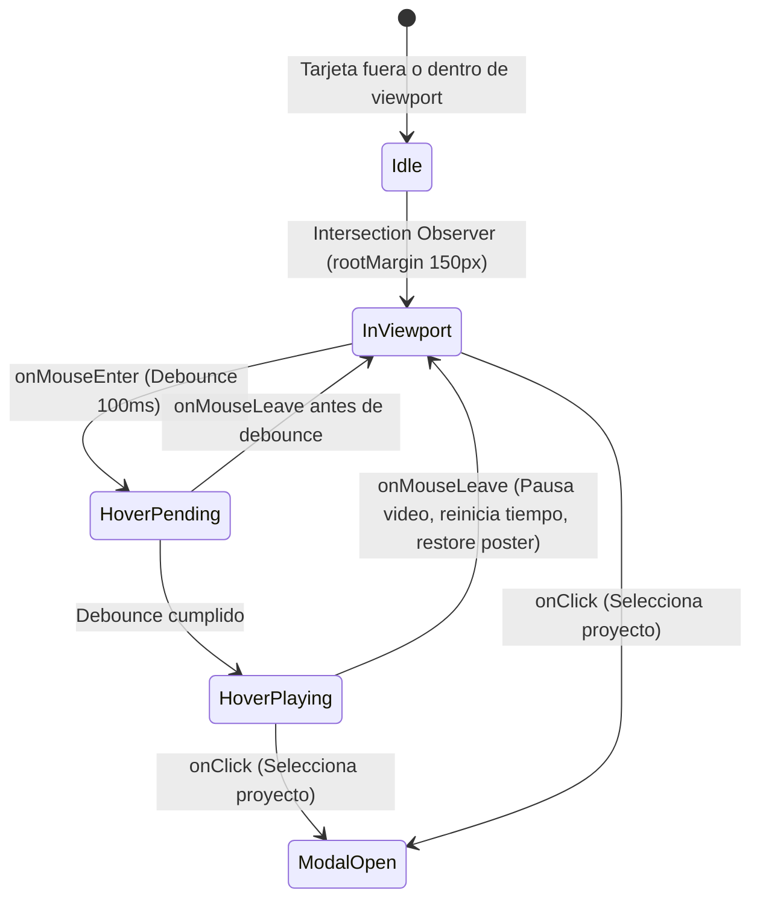
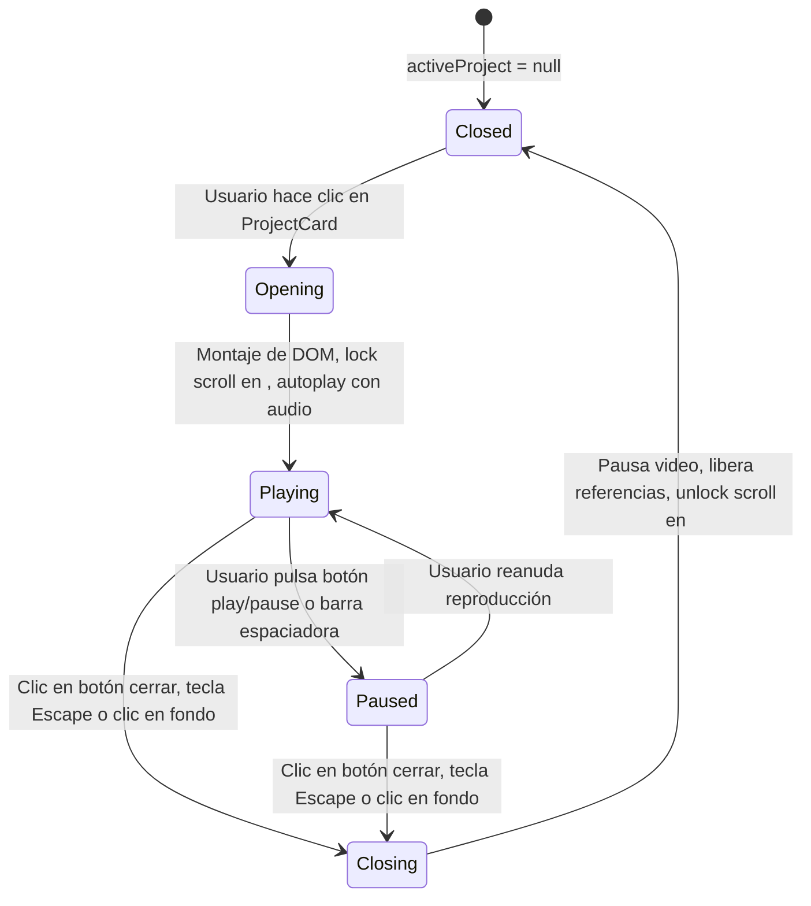

# Data Model & State Architecture: Lens Producciones

**Feature**: `001-audiovisual-portfolio`  
**Date**: 2026-10-02  
**Status**: Completed  

---

## 1. Entidades Principales

### 1.1 Project (Proyecto Audiovisual)
Representa una obra cinematográfica, comercial o pieza documental en el catálogo del portafolio.

```typescript
export interface Project {
  /** Identificador único alfanumérico en formato kebab-case (ej. 'audi-gt-e-tron') */
  id: string;

  /** Título de la producción (ej. 'Audi RS e-tron GT // Velocity') */
  title: string;

  /** Categoría temática principal para clasificación y filtrado */
  category: ProjectCategory;

  /** Descripción narrativa, ficha técnica, cliente o sinopsis de la obra */
  description: string;

  /** Ruta pública relativa al archivo de video (ej. '/videos/audi-gt.mp4') */
  videoUrl: string;

  /** Ruta pública relativa a la imagen estática de miniatura/poster (ej. '/thumbnails/audi-gt.webp') */
  thumbnailUrl: string;

  /** Bandera para destacar la pieza en posiciones prioritarias o visualizaciones especiales */
  featured: boolean;

  /** Metadatos opcionales de ficha técnica cinematográfica */
  metadata?: {
    year?: string;
    client?: string;
    role?: string;       // ej. 'Director / DP', 'Colorist'
    duration?: string;   // ej. '01:45'
  };
}
```

### 1.2 ProjectCategory (Categorías Disponibles)
Categorías predefinidas y normalizadas en el portafolio:

```typescript
export type ProjectCategory = 
  | 'Comercial'
  | 'Automotriz'
  | 'Evento'
  | 'Narrativo'
  | 'Documental';

export interface CategoryFilterItem {
  id: string;          // ej. 'all', 'comercial', 'automotriz'
  label: string;       // ej. 'Todos', 'Comercial', 'Automotriz'
  count?: number;      // Cantidad de proyectos asociados
}
```

---

## 2. Reglas de Validación de Datos

1. **Unicidad de `id`**: Todo elemento en `projects.json` debe poseer un `id` único no vacío, sin espacios ni caracteres especiales.
2. **Rutas Válidas de Medios**:
   - `videoUrl` debe comenzar con `/videos/` y terminar en extensión de video web soportada (`.mp4`, `.webm`).
   - `thumbnailUrl` debe comenzar con `/thumbnails/` y terminar en formato de imagen optimizado (`.webp`, `.jpg`, `.png`).
3. **Contenido Mínimo**:
   - `title`: Mínimo 2 caracteres, máximo 80 caracteres.
   - `description`: Mínimo 10 caracteres, no vacía.
   - `category`: Debe pertenecer a las categorías reconocidas en el sistema.

---

## 3. Modelo de Estados de Interfaz (UI State Transitions)

### 3.1 Ciclo de Estado de Tarjeta (`VideoCardState`)



- **Idle**: Video no renderizado en DOM o solo con metadatos precargados (`preload="metadata"`). Poster visible.
- **InViewport**: Componente listo para reproducción inmediata.
- **HoverPending**: Cursor posicionado sobre la tarjeta. Espera 100ms para filtrar movimientos de paso rápido.
- **HoverPlaying**: Miniatura con opacidad 0 (cross-fade), elemento `<video>` en reproducción silenciosa continua.
- **ModalOpen**: Notifica al estado global/página para montar el modal inmersivo con el proyecto activo.

### 3.2 Ciclo de Estado del Modal (`ModalState`)



### 3.3 Estado de Filtrado de Galería (`FilterState`)

- **Estado**: `selectedCategory: string` (Valor por defecto: `'all'`).
- **Comportamiento**:
  - Al cambiar de categoría, la lista visible se filtra instantáneamente en memoria (`projects.filter(...)`).
  - Las transiciones de entrada y salida de las tarjetas se animan fluidamente con CSS / Framer Motion (`AnimatePresence` / `layout`).
