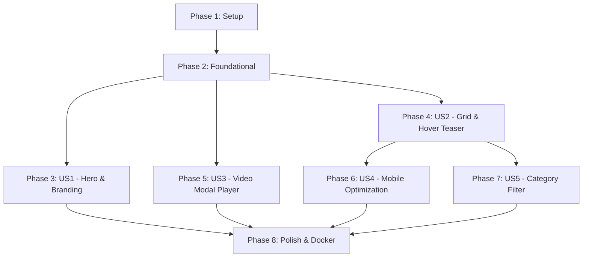

# Tasks: Portafolio Audiovisual para Lens Producciones

**Branch**: `001-audiovisual-portfolio` | **Date**: 2026-10-02 | **Spec**: [spec.md](./spec.md) | **Plan**: [plan.md](./plan.md)

---

## Phase 1: Setup (Shared Infrastructure)

**Purpose**: Inicialización del proyecto Next.js 15+ con TypeScript, Tailwind CSS y configuración de exportación estática.

- [X] T001 Initialize package.json with Next.js 15+, React 19, TypeScript, Tailwind CSS, Lucide React, and Framer Motion dependencies in package.json
- [X] T002 [P] Configure TypeScript compiler options in tsconfig.json
- [X] T003 [P] Configure Tailwind CSS with dark theme tokens, font scales, and content paths in tailwind.config.ts and postcss.config.mjs
- [X] T004 [P] Configure Next.js static site export with output 'export' and unoptimized images in next.config.ts

---

## Phase 2: Foundational (Blocking Prerequisites)

**Purpose**: Infraestructura central compartida (tipos, datos locales mock, utilidades, hook de Intersection Observer y estilos base).

**⚠️ CRITICAL**: El trabajo de las historias de usuario requiere que esta fase esté completada.

- [X] T005 Create TypeScript interfaces for Project, ProjectCategory, and UI states in src/types/project.ts
- [X] T006 [P] Create mock data catalog with high-quality filmmaker projects in src/data/projects.json
- [X] T007 [P] Implement project query, filtering, and validation helper functions in src/lib/projects.ts
- [X] T008 [P] Configure dark mode typography, CSS variables, and utility animations in src/app/globals.css
- [X] T009 [P] Implement reusable Intersection Observer hook for viewport detection in src/hooks/useIntersectionObserver.ts
- [X] T010 Set up public placeholder video teasers and high-resolution thumbnail posters in public/videos/ and public/thumbnails/
- [X] T011 Create root layout with metadata, viewport configuration, and font definitions in src/app/layout.tsx

**Checkpoint**: Base del proyecto lista. La implementación de historias de usuario puede comenzar.

---

## Phase 3: User Story 1 - Inmersión Inicial en Hero Section y Marca (Priority: P1) 🎯 MVP

**Goal**: Presentar un impacto audiovisual cinematográfico inmediato con Hero a pantalla completa, video en bucle silencioso, branding "Lens Producciones" y llamada a la acción para explorar el portafolio.

**Independent Test**: Cargar la página de inicio; el video ambiental debe reproducirse en bucle continuo y sin sonido detrás del logotipo y botón CTA, desplazando la vista al pulsar el botón de exploración.

### Implementation for User Story 1

- [X] T012 [P] [US1] Implement brand navigation header component with logo and social links in src/components/Navbar.tsx
- [X] T013 [US1] Implement fullscreen HeroSection component with background video loop, dark overlay, branding, and scroll CTA in src/components/HeroSection.tsx
- [X] T014 [US1] Integrate Navbar and HeroSection into the main landing page in src/app/page.tsx

**Checkpoint**: User Story 1 completa e independientemente testeable como MVP de presentación de marca.

---

## Phase 4: User Story 2 - Exploración del Catálogo y Previsualización Dinámica (Priority: P1)

**Goal**: Mostrar la cuadrícula de proyectos con miniaturas estáticas y reproducir un fragmento de video en bucle sin sonido al hacer hover, optimizado con lazy loading vía Intersection Observer.

**Independent Test**: Hacer scroll hacia la cuadrícula; los videos de tarjetas fuera de pantalla no deben descargar datos. Al pasar el cursor sobre una tarjeta, la miniatura se desvanece suavemente hacia el video en bucle mudo; al retirar el cursor, regresa al poster.

### Implementation for User Story 2

- [X] T015 [P] [US2] Implement VideoCard component with static poster, metadata tag, and accessible focus state in src/components/VideoCard.tsx
- [X] T016 [US2] Implement lazy loading hydration and debounced hover preview video loop logic inside src/components/VideoCard.tsx
- [X] T017 [US2] Implement PortfolioGrid container component to render projects in a responsive grid in src/components/PortfolioGrid.tsx
- [X] T018 [US2] Integrate PortfolioGrid into main landing page below HeroSection in src/app/page.tsx

**Checkpoint**: User Stories 1 y 2 funcionan conjuntamente, permitiendo explorar y previsualizar todo el catálogo.

---

## Phase 5: User Story 3 - Visualización Inmersiva en Modal de Pantalla Completa (Priority: P1)

**Goal**: Abrir un reproductor inmersivo a pantalla completa al hacer clic en cualquier proyecto, con controles personalizados (play/pause, timeline, volumen, fullscreen), ficha descriptiva, bloqueo de scroll y atajos de teclado.

**Independent Test**: Hacer clic en una tarjeta; el modal se abre en <150ms sobre la página, bloqueando el scroll de fondo y reproduciendo el video con controles funcionales. Presionar Escape o el botón de cierre detiene la reproducción y restaura el scroll en la misma posición.

### Implementation for User Story 3

- [X] T019 [P] [US3] Implement CustomControls component with play/pause, time scrubber, volume slider, and fullscreen toggle in src/components/CustomControls.tsx
- [X] T020 [US3] Implement VideoModal player component with backdrop blur, project narrative sidebar, keyboard shortcuts, and body scroll lock in src/components/VideoModal.tsx
- [X] T021 [US3] Wire project selection state between VideoCard, PortfolioGrid, and VideoModal in src/app/page.tsx

**Checkpoint**: El núcleo de la experiencia de portafolio cinematográfico (Hero + Grid con Teaser + Modal Inmersivo) está 100% operativo.

---

## Phase 6: User Story 4 - Experiencia Fluida en Dispositivos Móviles y Táctiles (Priority: P2)

**Goal**: Optimizar la experiencia táctil en pantallas móviles y tabletas sin errores de hover ni consumo desmedido de datos.

**Independent Test**: Reducir la ventana a dimensiones móviles; las tarjetas deben mostrar posters nítidos y pulsar una tarjeta debe abrir fluidamente el modal inmersivo para reproducción táctil.

### Implementation for User Story 4

- [X] T022 [P] [US4] Implement touch event handlers and tap-to-open logic for mobile devices in src/components/VideoCard.tsx
- [X] T023 [US4] Refine responsive grid breakpoints, touch target sizes, and mobile modal layout in src/components/PortfolioGrid.tsx and src/components/VideoModal.tsx

**Checkpoint**: Portafolio perfectamente utilizable en dispositivos móviles y de escritorio.

---

## Phase 7: User Story 5 - Filtrado por Categorías Temáticas (Priority: P3)

**Goal**: Permitir al visitante filtrar los proyectos por categoría ("Comercial", "Automotriz", "Evento", "Narrativo", "Todos") con transiciones de interfaz suaves.

**Independent Test**: Pulsar una categoría en la barra de filtros; la cuadrícula se actualiza al instante mostrando únicamente los proyectos asociados a dicha categoría sin recarga de página.

### Implementation for User Story 5

- [X] T024 [P] [US5] Implement CategoryFilter tab selector component with active indicator in src/components/CategoryFilter.tsx
- [X] T025 [US5] Connect CategoryFilter with project filtering logic and animated layout transitions in src/components/PortfolioGrid.tsx

**Checkpoint**: Todas las historias de usuario de la especificación han sido completadas.

---

## Phase 8: Polish, Containerization & Despliegue Coolify

**Purpose**: Configuración de contenedor Docker multi-etapa, servidor Nginx para SPA estática, pie de página del estudio y validación final de compilación.

- [X] T026 [P] Create optimized Nginx configuration with SPA fallback, gzip compression, and cache headers in nginx.conf
- [X] T027 [P] Create multi-stage production Dockerfile (Node builder + Nginx Alpine) in Dockerfile
- [X] T028 [P] Add footer component with production studio credits, contact info, and copyright in src/components/Footer.tsx
- [X] T029 Execute static build export validation via npm run build and verify out/ directory artifacts

---

## Dependencies & Execution Order

### Phase Dependencies



### User Story Dependencies

- **User Story 1 (P1)**: Depende únicamente de la Fase 2 (Foundational). Puede ser entregado y probado como MVP independiente.
- **User Story 2 (P1)**: Depende de la Fase 2 (Foundational). Comparte tipos y datos locales con US1.
- **User Story 3 (P1)**: Depende de US2 para la interacción de apertura desde `VideoCard`, pero su componente reproductor puede desarrollarse en paralelo con contratos de props independientes.
- **User Story 4 (P2)**: Refinamiento táctil y responsivo sobre los componentes creados en US2 y US3.
- **User Story 5 (P3)**: Filtro interactivo montado sobre el contenedor `PortfolioGrid` de US2.

### Parallel Opportunities

- **Fase 1 (Setup)**: T002, T003 y T004 pueden ejecutarse en paralelo tras T001.
- **Fase 2 (Foundational)**: T006, T007, T008 y T009 son archivos completamente independientes y pueden implementarse simultáneamente.
- **Historias de Usuario**: Una vez completada la Fase 2:
  - T012 (`Navbar.tsx`), T015 (`VideoCard.tsx`) y T019 (`CustomControls.tsx`) son independientes y pueden construirse en paralelo.
- **Fase 8 (Polish & Docker)**: T026 (`nginx.conf`), T027 (`Dockerfile`) y T028 (`Footer.tsx`) pueden crearse simultáneamente antes de T029.

---

## Parallel Example: User Story 2 & 3

```bash
# Desarrollo simultáneo de componentes de tarjeta y controles de video:
Task: "Implement VideoCard component in src/components/VideoCard.tsx"
Task: "Implement CustomControls component in src/components/CustomControls.tsx"
Task: "Implement CategoryFilter tab selector component in src/components/CategoryFilter.tsx"
```

---

## Implementation Strategy

### MVP First (User Story 1 + Grid Estático)
1. Completar Fase 1 (Setup) y Fase 2 (Foundational).
2. Completar Fase 3 (User Story 1: Hero Section).
3. **Validación de Checkpoint**: El sitio web carga un Hero cinematográfico funcional.

### Entrega Incremental
1. **Incremento 1**: Hero Section + Branding (MVP de presentación).
2. **Incremento 2**: Grid responsivo con hover preview y lazy loading (Catálogo visual activo).
3. **Incremento 3**: Modal inmersivo con controles personalizados (Visualización completa).
4. **Incremento 4**: Experiencia táctil móvil y filtrado por categorías (Polish de UX).
5. **Incremento 5**: Dockerfile + Nginx para despliegue inmediato en Coolify.

---

## Notes

- Todas las tareas respetan estrictamente el formato `- [ ] [TaskID] [P?] [Story?] Descripción con ruta de archivo`.
- Los videos de hover deben incluir obligatoriamente los atributos `autoPlay`, `muted`, `loop`, `playsInline` y `poster`.
- No se introducen dependencias de bases de datos externas ni servidores dinámicos en producción.
